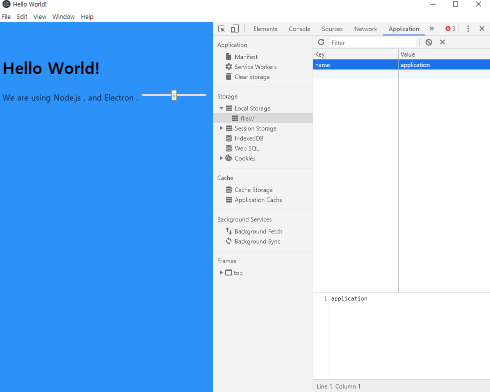
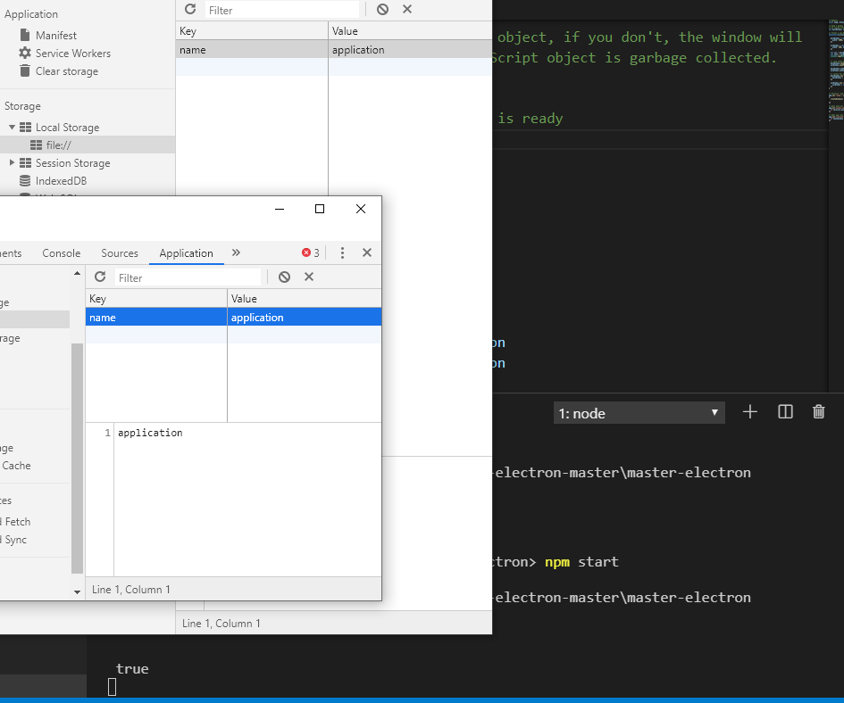

# 세션 

* 세션은 객체. 웹 콘텐트와 관련된 상태 정보를 저장하는 데 사용된다. `HTTP cache`, `Cookies`, `localStorage`, `indexedDB`가 포함된다. 일렉트론에서는 default session이라고 불리는 세션이 있는데, 이 세션은 모든 브라우저에서 공용으로 사용한다.    


* default sessions의 저장소는 영구적이다. 그러나 부수적인 세션들은 메모리 상에 올라가기 때문에 저장되지 않는다. 아래 사진은 key value pair를 저장해두고 어플리케이션을 종료한 뒤, 다시 어플리케이션을 실행시켰을 때 key value pair를 그대로 저장되어 있는 것을 확인한 장면이다.   


  
```js
function createWindow () {

  mainWindow = new BrowserWindow({
    width: 1000, height: 800
  })

  let ses = mainWindow.webContents.session
  console.log(ses)

  // Load index.html into the new BrowserWindow
  mainWindow.loadFile('index.html')

   mainWindow.webContents.openDevTools()

  // Listen for window being closed
  mainWindow.on('closed',  () => {
    mainWindow = null;
  })
}
```

* mainWindow와 secondWindow와의 세션은 같을까? 


```js
function createWindow () {

  mainWindow = new BrowserWindow({
    width: 1000, height: 800
  })

  secWindow = new BrowserWindow({
    width: 200, height: 200
  })

  let ses = mainWindow.webContents.session
  let ses2 = secWindow.webContents.session
  console.log(Object.is(ses, ses2))

  // Load index.html into the new BrowserWindow
  mainWindow.loadFile('index.html')
  secWindow.loadFile('index.html')

  mainWindow.webContents.openDevTools()
  secWindow.webContents.openDevTools()

  // Listen for window being closed
  mainWindow.on('closed',  () => {
    mainWindow = null;
  })

  secWindow.on('closed', () => {
    secWindow = null;
  })
}
```
같다. 그러므로 저장되어있는 정보도 같고, Console.log 에서도 true가 출력된다.  
 

session 모듈에서 직접 session을 쓸 수 도 있다.  
```js
const {app, BrowserWindow, session} = require('electron');
// ... 
let ses = mainWindow.webContents.session
let ds = session.defaultSession
console.log(Object.is(ses, ds))
// result : true
```

* 커스텀 세션을 만들어, 디폴트 세션 대신 브라우저에게 커스텀 세션을 제공할 수도 있다. 커스텀 세션을 만드는 이유는 여러가지가 있을 수 있는데, 주로 여러개의 창들의 상태를 동일하게 맞춰주는데에 사용된다.  

> 커스텀 세션의 선언 
```js
let customSession = session.fromPartition('partition_1')

//...
let ds = session.defaultSession
console.log(Object.is(customSession, ds))
// result : false
```
> 커스텀 세션을 주입 
```js
let customSession = session.fromPartition('partition_1')
mainWindow = new BrowserWindow({
width: 1000, height: 800,
webPreferences : {
    session : customSession
}
})

let ses = mainWindow.webContents.session

console.log(Object.is(customSession, ses)
// result true 
```

다만 기본 커스텀 세션은 디폴트 세션처럼 영구적이지 않다. 파티션 이름에 접두사 `persist:`를 더한다면 영구적인 파티션을 얻을 수 있다.  
```js
let customSession = session.fromPartition('persist:partition_1')
```

커스텀세션을 문자열로 직접 주입할 수 도 있다. 주입시 만약 해당 세션이 존재하지 않는다면, 그러한 세션을 만든다.  
```js
mainWindow = new BrowserWindow({
width: 1000, height: 800,
webPreferences : {
    session : `persist:partition_1`
}})
```

세션에서 데이터를 삭제할 수 도 있다. 
```js
customSession.clearStorageData();
```

EOF